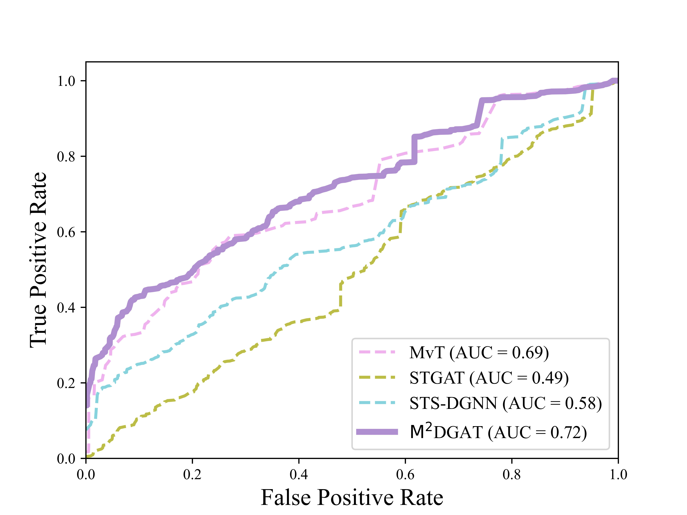

# M$$^{2}$$DGAT

​	Motivated by multi-view modeling practices, this study proposes the STPD-DGAT method aims to capture disease-specific spatiotemporal embeddings from whole-blood RNA sequencing data, thus conducting progression modeling for PD. The main purpose of this STPD-DGAT method is to assess staging of PD with
spatiotemporal embeddings.

# Architecture

Gene networks play the role of spatial patterns.

Topological changes of PD-GRN have potential impact on information flow at the molecular level.


# Install

pip install -r requirements.txt

## Requirements

python == 3.9.16

scanpy == 1.5.1

scikit-learn==1.2.1

scipy==1.9.3

torch==2.0.0

torch-cluster==1.6.1+pt20cu118

torch-geometric==2.2.0

torch-optimizer==0.3.0

torch-scatter==2.1.1+pt20cu118

torch-sparse==0.6.17+pt20cu118

torch-spline-conv==1.2.2+pt20cu118

# Data availability

Whole-blood transcriptome data and metadata used for PPMI  datasets were downloaded from
https://www.ppmi-info.org/. For the PDBP data, transcriptomics data was downloaded from https://amp-pd.org/.

# Usage

1，Run MEGENA.R

Run MEGENA.R to generate gene co-expression networks.

2，Run Multi-scale_fusion.ipynb

Run Multi-scale_fusion.ipynb  to fuse the global and local gene graph.

3，Run train.py

The train.py  file is used to obtain the final prediction results. The command statements are as follows:

```
python train.py
```

The following types of data are required before running this command:

- expression.csv------- gene expression matrix at each moment in time
- adj.csv------- gene co-expression network at each moment in time
- label.csv------- corresponding labels, using H&Y.

# GCN networks


# Comparison of ROC curves for dual view models



​																					(a) PPMI


​                                                                                    (b) PDBP